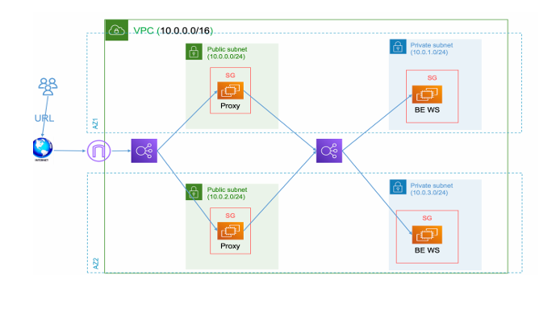
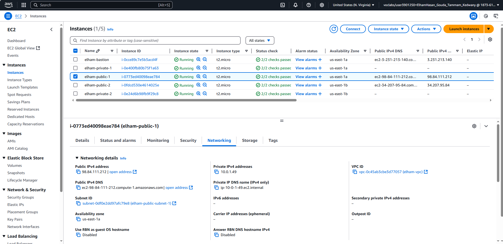
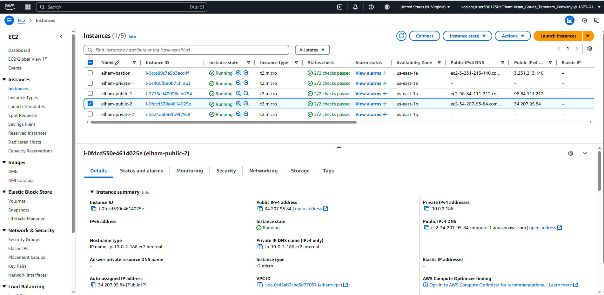
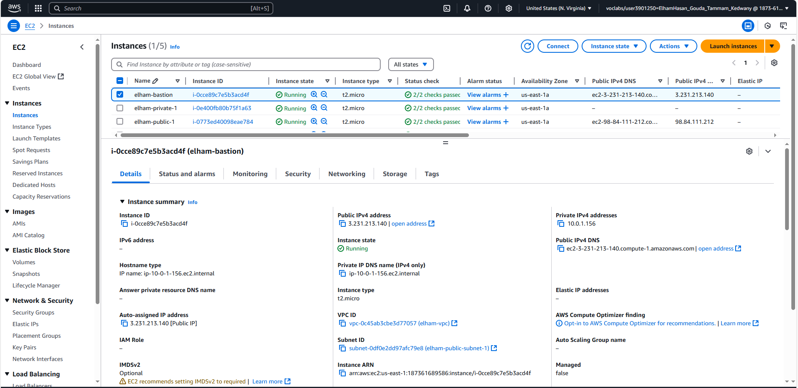
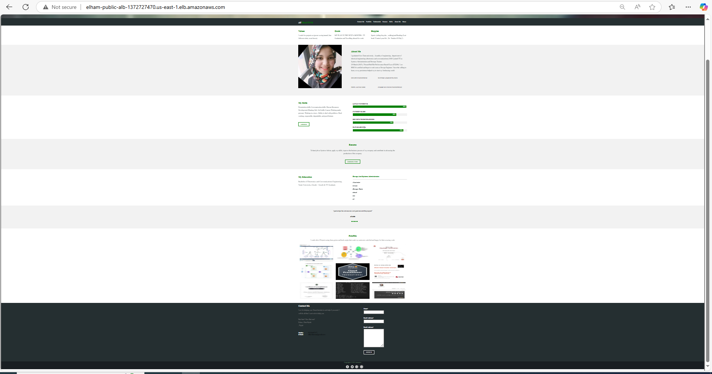

# 🚀 Professional Multi-Tier AWS Architecture with Terraform

## 🌟 Overview
This project demonstrates the full provisioning of a production-grade, secure, and modular AWS environment using **Terraform** and **Shell scripting**, entirely deployed from a **CentOS virtual machine**.

It includes a full DevOps pipeline approach from networking to EC2 provisioning, automation with remote-exec and local-exec, NGINX reverse proxy setup, and highly available infrastructure with load balancers – all written in reusable, clean, and scalable modules.

In addition to the infrastructure, this project also includes a custom-designed **personal web page** fully built by **Elham**, featuring her CV, project portfolio, contact information, and key skills – served via Apache on private EC2s and accessed publicly through an NGINX reverse proxy.

---



---

## ✅ Main Features

- 🔧 **Infrastructure as Code (IaC)** using **Terraform v1.6+**
- 🧱 **Custom VPC** with public/private subnets, NAT Gateway, Internet Gateway
- 🔐 **Secure Bastion Host** access to private instances
- 💻 **Public EC2s with NGINX Proxy**, **Private EC2s with Apache Web Server**
- 🌀 **Load Balancers (Public & Private)** integrated with target groups
- 📦 **Provisioning via Remote-Exec:** install NGINX, Apache, and auto-deploy web content
- 🧑‍💼 **Personal Web Page by Elham**: CV, portfolio, contact info
- 🔁 **Terraform Backend:** S3 + DynamoDB for remote state and locking
- 🧩 **Modular Architecture**: Reusable modules for VPC, EC2, LB, SG, etc.
- 🧰 **Shell Scripting Bootstrap**: for provisioning, uploading content
- 📃 **Outputs & IP Recording** with `local-exec` written to `all-ips.txt`
- 🧪 **Tested Fully on CentOS VM** to simulate real-world scenario

---

## 🗂️ Project Structure
```
terraform-final-project/
├── bootstrap/                # Shell scripts for provisioning
│   ├── install-nginx.sh
│   ├── install-apache.sh
│   └── upload-content.sh
│
├── terraform-pro/            # Terraform root config
│   ├── main.tf               # Module calls
│   ├── variables.tf
│   ├── outputs.tf
│   ├── terraform.tfvars
│   ├── backend.tf            # Remote backend (S3 + DynamoDB)
│   └── modules/              # Reusable modules
│       ├── vpc/
│       ├── ec2/
│       ├── lb/
│       ├── security_group/
│       └── s3/
│
├── web-content/              # Personal web page by Elham
│   ├── index.html            # Contains Elham's CV and portfolio
│   ├── styles.css
│   └── images/
└── README.md
```

---

## ☁️ Technologies Used

- **Terraform** (v1.6+)
- **AWS CLI** and **IAM Roles**
- **NGINX** as Reverse Proxy
- **Apache** for serving static content
- **S3 & DynamoDB** for remote state
- **CentOS VM** as development environment

---

## 📷 Included Screenshots
## 📷 Screenshots
### 🔹 NGINX Reverse Proxy in AZ1 serving Apache content from Private EC2


---

### 🔹 NGINX Reverse Proxy in AZ2 serving Apache content from Private EC2


---

### 🔹 Bastion Host Wich Is Used Access Private EC2


---

### 🔹 Terraform Apply Output (Successful)


---


## 📌 How to Deploy
```bash
cd terraform-pro
terraform init
terraform workspace new dev
terraform plan
terraform apply
```

All provisioning (NGINX, Apache, content upload) will run via remote-exec. After deployment, the NGINX public DNS will serve content from the Apache private servers.

---

## ✨ What Makes This Special?

This is not just a Terraform project. It's a **realistic end-to-end DevOps use case**:
- Developed and deployed on a local CentOS VM simulating real-world usage
- Built with best practices: modularization, automation, provisioning, remote state
- Covers networking, compute, load balancing, access control, and web delivery
- Includes bootstrapping scripts and Terraform logic to mimic production
- 🎨 Personal CV Website by Elham auto-deployed on Apache with reverse proxy access

It shows a complete skillset for any Cloud/DevOps role.

---

## 👩‍💻 Author
**Elham**  
🔧 Terraform | AWS | DevOps Enthusiast | Web Designer  
🚀 Built from scratch locally on CentOS  
📬 GitHub: https://github.com/elhamhassan90  
🔗 LinkedIn: www.linkedin.com/in/elham-hasan-6b029433a  
🌐 Portfolio: Deployed inside this project – access via public Load Balancer URL!

---

⭐ *If you found this useful or inspiring, star the repo and connect with me!*


